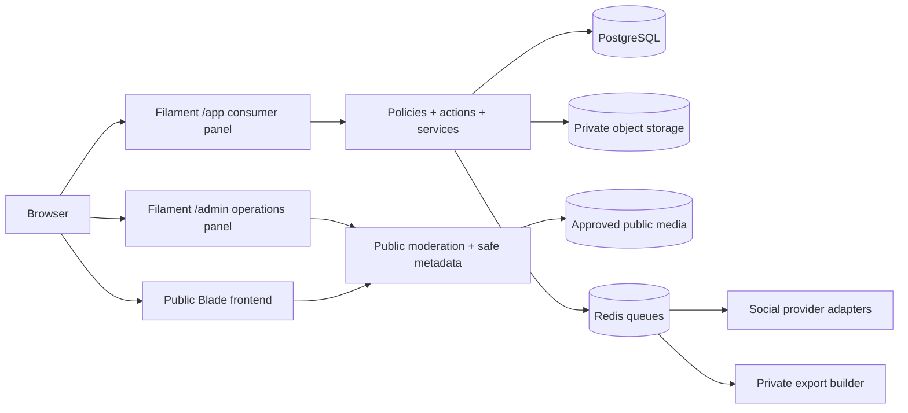
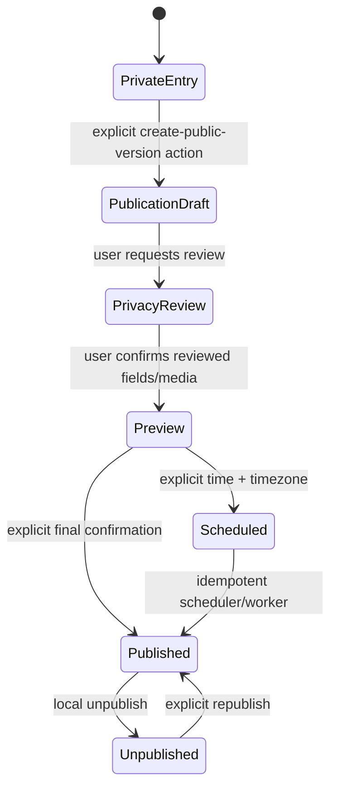

# Architecture

This document explains Memoria's application boundaries and the reasons behind them. It is written for maintainers, reviewers, and operators.

## System shape

Memoria is one Laravel application with three deliberately different delivery surfaces:

The private application and public site share models but not authorization assumptions. The admin panel is not a privileged copy of the private app; it exposes accounts, public community content, delivery failures, and audit metadata only.

## Primary privacy boundary

`Entry` and `Publication` are separate aggregates.

Creating a publication copies an entry revision into new columns inside a transaction. Exact location and private attachments are omitted by default. The publication can then diverge from its source. Publishing never reads the entry body directly at render time.

Deletion and privacy changes on a source entry therefore cannot accidentally reveal new content. An existing published snapshot has its own lifecycle. Account erasure removes owned local publications and media; already delivered remote social copies remain subject to provider behavior and are disclosed to the user.

## Application layers

### Models and policies

Models define casts, relationships, constrained scopes, and small state predicates. Policies are the final server-side authorization boundary. Private-resource policies grant access only to the owner or an explicit view-only recipient where that feature applies. Administrative roles are intentionally absent from private policy bypasses.

### Actions and services

Actions represent atomic user intentions such as creating a publication snapshot, publishing, scheduling, unpublishing, creating/revoking a share, building an export, or deleting an account. Services coordinate reusable boundaries such as auditing and social provider resolution.

Internal database changes use transactions. No transaction remains open during external HTTP. Queue dispatch occurs after commit.

### Jobs

External delivery, scheduled publication, large exports, expiration cleanup, and reminders run through queues. Jobs use finite timeouts, controlled retries/backoff, idempotency keys, and atomic locks. Queue `retry_after` is kept above the longest job timeout so a live job is not released to another worker. A website target becomes public only after the local publish transaction commits; each social target records its own confirmed or failed delivery state independently.

### Controllers and Filament/Livewire

Controllers and panel actions validate/authorize and then delegate. Blade views contain presentation only. Livewire component actions apply the same authorization and validation rules as normal HTTP requests.

## Social provider boundary

Every provider implements one contract and returns a normalized result. The provider owns capability differences, limits, HTTP details, remote identifiers, and error classification. Local/test environments bind a deterministic fake implementation; tests never call an external API.

A publication target identifies one exact `SocialAccount`. If several connected identities use the same provider, provider-only input is rejected rather than silently choosing the newest connection. Owner scope is enforced both when the target is configured and again when a queued job resolves the publication/account/target chain.

A `SocialPost` stores the idempotency key and durable truth for that destination. Attempt details are stored separately without credentials or private diary text. Pending, scheduled, processing, published, retrying, failed, cancelled, disconnected, token-expired, removal-requested, removed, and removal-failed states remain distinct. Fake-provider success is displayed as simulation and never as an external post. Provider links are exposed only after HTTPS scheme, credentials, port, and provider-origin checks.

An explicit retry locks and re-authorizes the same record, preserves its idempotency key and request fingerprint, and records only provider/attempt metadata in the audit log. A retryable provider failure may be resent; a disconnected/token-expired delivery requires the same identity to be connected again. Permanent rejection, an inactive publication, a foreign account, or a changed/cancelled destination is refused. Local idempotency prevents duplicate jobs, but remote duplicate guarantees vary by provider and the UI warns about an ambiguous lost response.

Unpublishing, editing or archiving a published version, moderation, account disconnection, and account deletion create a durable remote-deletion request for every provider-confirmed post before local tokens or owning rows are destroyed. A provider post created during a concurrent cancellation is deleted immediately when possible; a failed compensation attempt enters the same durable retry path. The outbox contains a keyed remote fingerprint plus only the minimal encrypted remote identifier and credential snapshot required by the adapter. A unique deletion key and provider `404`/`410` handling make repeated DELETE attempts idempotent. A social-queue job uses bounded backoff, while the scheduler rediscovers stranded requests every five minutes. Success erases the encrypted snapshot. Permanent rejection or exhausted retries also erase it, record privacy-safe failure metadata, and preserve the truthful state that an external copy may remain.

OAuth onboarding is capability-aware. The current X and LinkedIn paths start only when a real driver, client credentials, and an exact callback are configured. Facebook Pages additionally requires explicit Page selection plus Page-token exchange; Mastodon requires registration against a user-selected HTTPS instance. Until those flows are implemented and operator-verified, their buttons stay unavailable. Memoria never collects provider passwords or treats a personal-profile token as a Page publishing credential.

Adapter behavior follows the provider contracts: [X post creation](https://docs.x.com/x-api/posts/manage-tweets/introduction), [LinkedIn Posts API](https://learn.microsoft.com/en-us/linkedin/marketing/community-management/shares/posts-api?view=li-lms-2026-06), [LinkedIn permalink guidance](https://learn.microsoft.com/en-us/linkedin/marketing/community-management/shares?view=li-lms-2026-05), [LinkedIn versioning](https://learn.microsoft.com/en-us/linkedin/marketing/versioning?view=li-lms-2026-05), [Meta Pages publishing](https://developers.facebook.com/docs/pages-api/posts/), and [Mastodon status creation](https://docs.joinmastodon.org/methods/statuses/). These upstream contracts remain deployment-time dependencies, not guarantees made by Memoria.

## Storage boundary

- Private originals live on `MEMORIA_PRIVATE_DISK`, normally local private storage in development and a private S3-compatible bucket in production.
- Publication media is copied/re-encoded to `MEMORIA_PUBLIC_DISK` only after explicit selection.
- Public records store public-copy paths, never private original paths or URLs.
- Private downloads pass through owner/share authorization on application routes and return `no-store` responses.
- Export archives use private storage, expire, and are deleted by scheduled cleanup.

Uploads enter a `Pending` state and a unique after-commit job invokes the attachment-scanner contract. Local/testing may use the deterministic fake scanner; production is fail-closed unless `MEMORIA_ATTACHMENT_SCANNER=clamav` is configured with a working, regularly updated `clamscan` binary. Clean, rejected, and infrastructure-failed outcomes are persisted, and every download path requires `Clean`.

## Search

Search always starts from an authenticated user's owner-scoped `Entry` query, then applies allow-listed filters. It does not use a shared unscoped result cache. The initial implementation uses database queries suitable for SQLite development and indexed PostgreSQL filters in production. A future PostgreSQL full-text or external search adapter must carry `user_id` as a mandatory security filter.

Entry bodies are queryable and therefore are not application-field-encrypted. Database volumes and backups must be encrypted by the infrastructure provider. Search and encryption tradeoffs are described in [privacy architecture](privacy-architecture.md).

## Caching and concurrency

Private cache keys include the authenticated user ID and relevant authorization context. Public publication cache keys contain only already-public IDs/slugs. Scheduled publication and social delivery acquire distributed locks and also rely on database uniqueness/idempotency constraints, protecting both multi-worker concurrency and restarts.

HTTP requests receive a server-generated opaque request ID. It is the only request-derived value added to Laravel's log context and is automatically carried into jobs dispatched by that request. Request bodies, headers, URLs, usernames, diary identifiers, and locations are deliberately excluded from correlation context.

## Extension points

The architecture can add provider adapters, importers, a search driver, malware scanners, public custom domains, or mobile/API clients without merging the private and public models. Future end-to-end encryption would require a separate search and sharing design; it is not a drop-in cast change.
