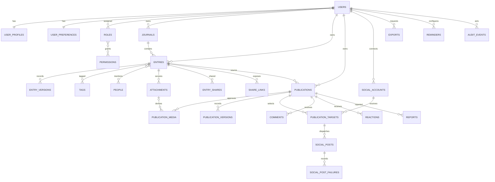

# Database reference

PostgreSQL is the production database. SQLite is supported for local development and fast tests. Migrations use portable string columns plus PHP enums rather than database-native enums.

## Entity relationship overview

## Ownership and key constraints

- Every private aggregate carries a direct or relationship-derived owner. Query code does not accept a client-supplied owner ID.
- Usernames and normalized per-owner tag/journal slugs are unique.
- Entry discovery indexes combine `user_id` with occurred date, journal, favorite, status, archive, and deletion fields.
- Public routes bind by profile username and owner-scoped publication slug. Public queries additionally require `Published` status and a non-null publish time.
- Social accounts are unique by owner/provider/provider identity. Social posts and publication targets carry uniqueness/idempotency constraints that prevent duplicate remote delivery.
- Share link tokens are stored as unique SHA-256 hashes. The clear token exists only in the creation response/URL.
- Foreign-key delete actions are intentional: private child records generally cascade with their owner; publication source references become nullable so snapshots remain structurally independent until owner/account erasure.
- Soft deletion is limited to user-restorable private content such as journals, entries, people, and attachments. Publications use an explicit archive/restore lifecycle that cancels active local delivery before preserving the public snapshot. Immutable history/audit rows are not casually soft-deleted.

## Significant tables

| Table group | Purpose | Sensitive fields |
| --- | --- | --- |
| `users`, `user_profiles`, `user_preferences` | Identity, optional public profile, locale/timezone/appearance/notification settings | password, TOTP secret/recovery codes |
| `roles`, `permissions`, pivots | Central role/capability mapping | none; changes are security events |
| `journals`, `entries`, versions/tags/people pivots | Private memory organization and history | entry title/body, mood, exact location, person notes |
| `attachments` | Private originals and validation/scan metadata | private path, original filename, checksum |
| `publications`, media/versions/targets | Independent public snapshot and delivery plan | publication draft until published |
| `social_accounts`, posts/failures | OAuth credentials and provider truth | encrypted access/refresh tokens |
| `entry_shares`, `share_links` | Explicit private view access | token hash, password hash, expiry, view metadata |
| `exports` | Private queued archive lifecycle | private path, size, and expiry |
| `comments`, `reactions`, `reports` | Public community/moderation only | report details/moderator notes |
| `audit_events` | Privacy-safe security and publication facts | hashed network/user-agent metadata; never bodies/tokens |

## Time and timezone rules

All instants are stored in UTC. A naive entry time is interpreted in the submitted IANA timezone before storage; an explicit numeric UTC offset is honored. Entries retain that timezone and persist the derived local calendar date in indexed `occurred_on`. Calendar, date-range, and “On this day” queries use `occurred_on`, so a memory just after midnight stays on the date the writer experienced even when its UTC instant falls on the previous day.

Scheduled publications are converted from the user's IANA timezone to UTC and displayed back in that timezone. A one-time nonexistent or ambiguous wall time is rejected unless an explicit numeric UTC offset disambiguates it. Recurring reminders keep their chosen local wall time: a spring-forward occurrence moves forward by the clock-change gap, and a fall-back occurrence runs only at the first occurrence of the repeated time.

`created_at` is never used as the remembered event date.

## Migration and rollback policy

Migrations are reversible and create foreign keys/indexes in dependency order. Production deployments take a verified backup before schema changes and use expand/migrate/contract changes for destructive evolution. Never rewrite a migration already applied outside local development; add a new migration.
